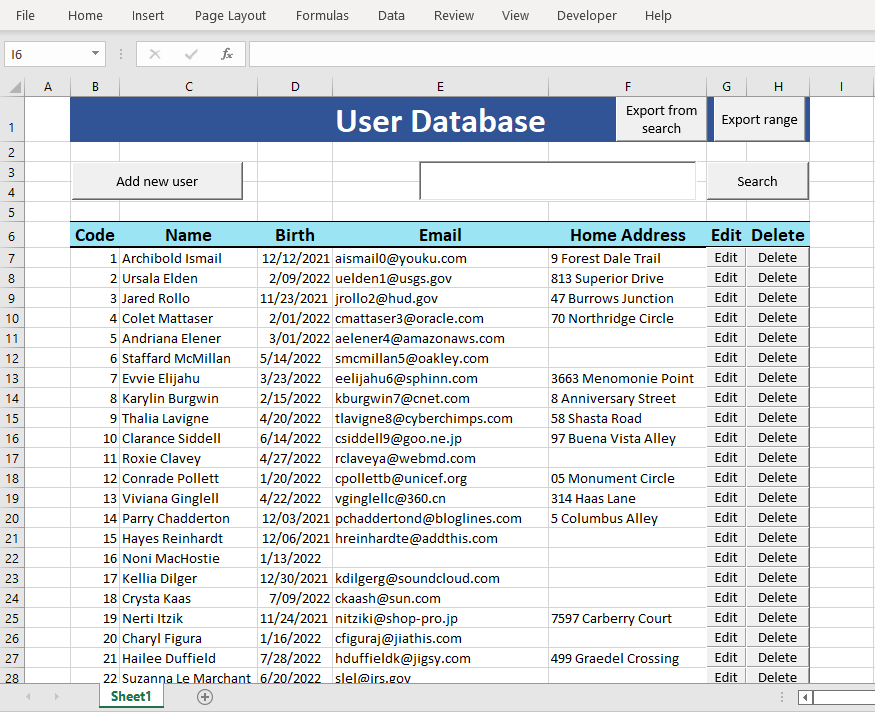
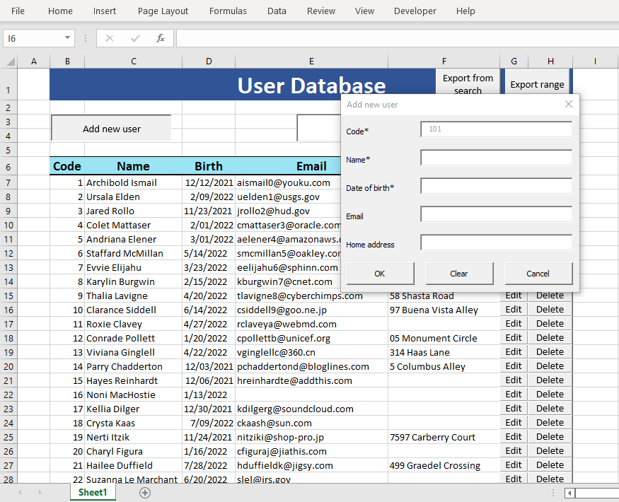
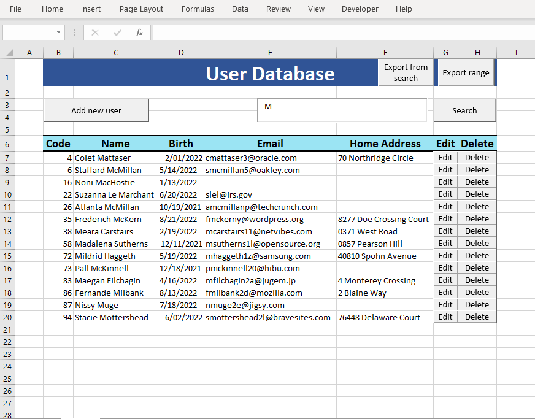
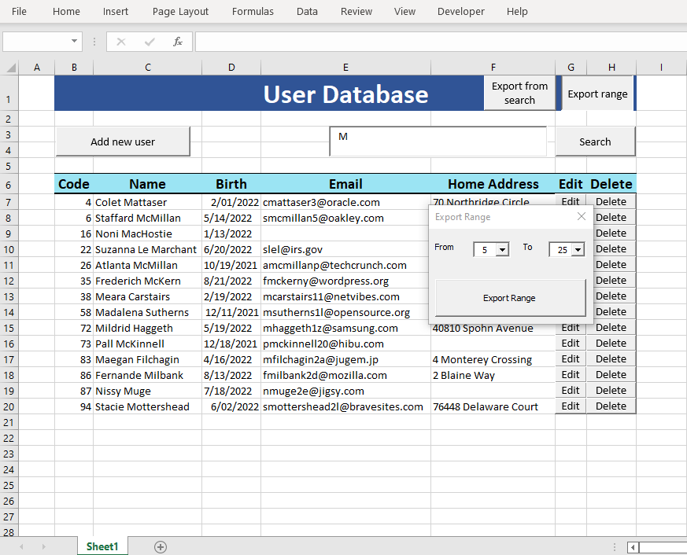
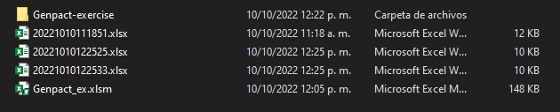
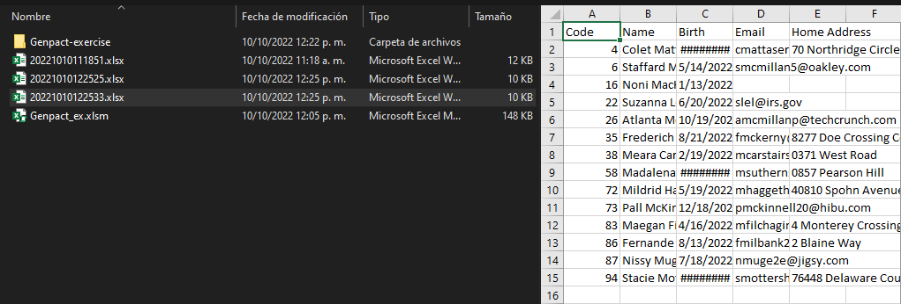

# Genpact-exercise

Programming exercise to be done in Python and VBA.

## Programming exercise

Build a excel consolidation tool with a folder watcher.

### Basic guidelines:

- You can use either C#, python or java languages. Please follow OOP.

### Solution Description:

- Build a solution, which monitor a folder looking for new files.
- Each time a file is found, it should verify if is an excel file (.xls\* files). If is true, it should take each sheet on it and consolidate it on a master workbook file (make a copy from each sheet to the master file).
- It should have an option to choose which folder to watch.
- Every file found should be moved to 2 different folders depending if was or not a excel file
  - Processed
  - Not applicable.

### How to use

Install the dependecies and then execute the file with the command:

```sh
python -m pip install -r requirements.txt
python main.py
```

Then you are going to be prompted to insert the name of the folder that is going to be observed (the folder can exist or not).

```
Input the lookup folder ["./lookup"]:
```

3 folders should be created automatically:

- `lookup` (if you just press enter or the observed folder)
- `no_applicable`
- `processed`

And a workbook called `master_workbook.xlsx` if it doesn't exists.

## VBA Exercise

VBA Exercise: Build a database on Excel ant its administrator forms, please the in mind the point below:

### Basic guidelines:

- It should be build using VBA only, avoid using excel formulas.
- Split the solution on different modules/functions/procedures grouping related functionalities on modules. Avoid extensive procedures/modules.
- Every variable/constant must be declared which should match to its datatypes. Avoid using undeclared/variant variables.

### Solution description:

- Create a sheet on excel which will be used as database. It should have five different columns: Code, Name, date of birth, Email, Home Address. This sheet should be always hidden with no option to unhide manually just programmatically.
- Create a user form with the options below:
  - New record: it should enable the user to create new records on the database sheet, consider the points below:
    - Code: mandatory field, locked, Auto-numeric/correlative. It should automatically populate the next code based on database data. Codes correlative increments by 1.
    - Name: mandatory field.
    - Date of birth: mandatory field, it should be validating its on date format (mm/dd/yyyy) and lower the current date.
    - Email: optional field, it should validate email format (ex: aa@aa.com) or blank.
    - Home address: optional
  - Search: it should enable the user search elements on the database sheet. It should be able to use Code (exact match) or Name (Contains the keywords) as search key. If Name is used as search key all multiple coincidences found should be displayed. The user should be able to edit or delete the selected record found.
    - Edit: all rules from new records applies.
    - Edit/Delete: show a confirmation box before saving changes.
  - Export data from database sheet to new excel book. It should have 2 different modes:
    - By code range: export all data between code ranges selected (ex: from 5 to 10)
    - By names Initials: export all data starting with the keyword selected.

### How to use

When you open the Excel file you can see the user interface like this:



With the options of:

- Add new user
- Search for a user code or name keyword
- Export range
- Export from search

### Add user

To add a user you need to press the `Add new user` and you'll see a form to insert a user:



### Search for a user

To search for a user or list of users you need to write the code or a name keyword:



### Export

To export to a new workbook of Excel you need to press either `Export from search` to export the list shown or `Export range` to export from code to another code (i.e. from code 5 to code 25).



Then in the same folder as the main Excel file you'll see new files with numbers in its name.



Containing the data you exported.


